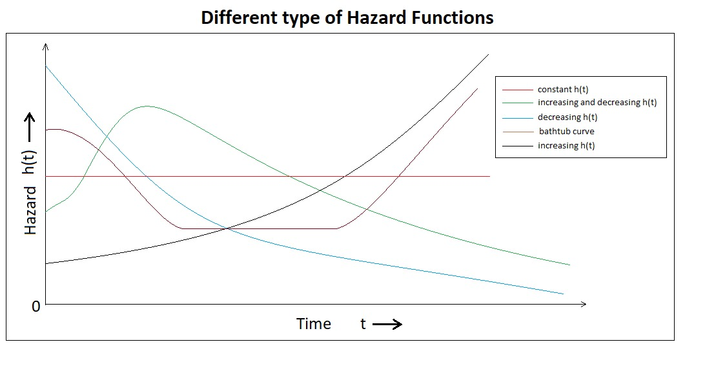
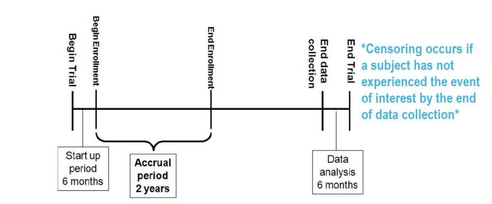

- **This class will provide theoretical as well as hands-on instruction and exercises covering basic survival analysis using R.**
- **Some References for further reading:**
  - <span style="text-decoration:underline">*Clark, T., Bradhurn, M., Love, S., & Altman, D. (2003). Survival analysis part I: Basic concepts and first analysis.232-238.ISSN 0007-0920.*</span>
  - <span style="text-decoration:underline">*Clark, T., Bradhurn, M., Love, S., & Altman, D. (2003). Survival analysis part II: Multivariate data analysis- an introduction to concepts and methods. British Journal of Cancer, 89(3),431-436.*</span>
  - <span style="text-decoration:underline">*Clark, T., Bradhurn, M., Love, S., & Altman, D. (2003). Survival analysis part III: Multivariate data analysis- choosing a model and assessing its adequacy and fit. British Journal of Cancer, 89(4),605-11.*</span>
  - <span style="text-decoration:underline">*Clark, T., Bradhurn, M., Love, S., & Altman, D. (2003). Survival analysis part IV: Farther concepts and methods in survival analysis. 781-786.ISSN 0007-0920.*</span>

- **It is assumed that the readers are familiar with R Programming. If not then get some basic R programming knowledge and then comeback.**
- **In this tutorial I have used some random toy data set as well as some R inbuilt data sets.**
- **Some packages we'll be using here include:**
  - *lubridate*
  - *survival*
  - *cmprsk* and some others.

**Lets start....**

# Introduction

Generally, Survival Analysis is a collection off statistical procedures for data analysis for which the outcome variable of interest is <span style="text-decoration:underline">**time until an event occurs.**</span>. More precisely, consider an example; suppose we want to study that how diabetes rate differed between males and females. So, here we will use some basic categorical data analysis – comparing proportions (risks, rates, etc) between different groups using a chi-square or fisher exact test, or logistic regression. Note that, in this kind of analysis you implicitly assume that the rates are constant over the period of the study, or as defined by the different groups you defined.

But, in longitudinal studies where you track samples or subjects from one time point (e.g., entry into a study, diagnosis, start of a treatment) until you observe some outcome event (e.g., death, onset of disease, relapse), it doesn’t make sense to assume the rates are constant. For example: the risk of death after heart surgery is highest immediately post-op, decreases as the patient recovers, then rises slowly again as the patient ages. Or, recurrence rate of different cancers varies highly over time, and depends on tumor genetics, treatment, and other environmental factors.


#### Examples for Time-to-Event data

**Examples from cancer** 

- Time from surgery to death
- Time from start of treatment to progression
- Time from response to recurrence

**Examples from other fields**

- Time from HIV infection to development of AIDS
- Time to heart attack
- Time to onset of substance abuse
- Time to initiation of sexual activity
- Time to machine malfunction
  
**Aliases for survival analysis**

- Reliability analysis
- Duration analysis
- Event history analysis
- Time-to-event analysis

# Examples of Survival Data

In the following you can see how the survival data looks like. For this, I've used some R's inbuilt datasets which are available under different packages.

## (A) The lung dataset

The *lung* dataset is available inside the *survival* package in R. The data contain subjects with advanced lung cancer from the North Central Cancer Treatment Group.

- **time:** Survival time in days
- **status:** censoring status 1=censored, 2=dead
- **sex:** Male=1, Female=2

I'm ignoring the other variables for simplicity. You can explore those by your self.

<table>
 <thead>
  <tr>
   <th style="text-align:right;"> time </th>
   <th style="text-align:right;"> status </th>
   <th style="text-align:right;"> age </th>
  </tr>
 </thead>
<tbody>
  <tr>
   <td style="text-align:right;"> 306 </td>
   <td style="text-align:right;"> 2 </td>
   <td style="text-align:right;"> 74 </td>
  </tr>
  <tr>
   <td style="text-align:right;"> 455 </td>
   <td style="text-align:right;"> 2 </td>
   <td style="text-align:right;"> 68 </td>
  </tr>
  <tr>
   <td style="text-align:right;"> 1010 </td>
   <td style="text-align:right;"> 1 </td>
   <td style="text-align:right;"> 56 </td>
  </tr>
  <tr>
   <td style="text-align:right;"> 210 </td>
   <td style="text-align:right;"> 2 </td>
   <td style="text-align:right;"> 57 </td>
  </tr>
  <tr>
   <td style="text-align:right;"> 883 </td>
   <td style="text-align:right;"> 2 </td>
   <td style="text-align:right;"> 60 </td>
  </tr>
  <tr>
   <td style="text-align:right;"> 1022 </td>
   <td style="text-align:right;"> 1 </td>
   <td style="text-align:right;"> 74 </td>
  </tr>
</tbody>
</table>

## (B) The alloauto dataset

Consider the *alloauto* dataset in the *KMSurv* library in R. This contains 90 measurement on Leukemia treated patients with allogeneic and autologous Transplantation.

<span style="text-decoration:underline">*Klein and Moeschberger (1997) Survival Analysis Techniques for Censored and truncated data, Springer. Kardaun Stat. Nederlandica 37 (1983), 103-126.*</span>

- **time:** *Time to death or relapse months*
- `\(\mathbf{\delta}\)`:  0= alive without replace, 1 = dead or relapse
- **Event:** 0= alive(Censored), 1= dead(Event)
- **type:** Transplant, 1=allogeneic, 2=autologous

<table>
 <thead>
  <tr>
   <th style="text-align:right;"> time </th>
   <th style="text-align:right;"> type </th>
   <th style="text-align:right;"> delta </th>
  </tr>
 </thead>
<tbody>
  <tr>
   <td style="text-align:right;"> 0.030 </td>
   <td style="text-align:right;"> 1 </td>
   <td style="text-align:right;"> 1 </td>
  </tr>
  <tr>
   <td style="text-align:right;"> 0.493 </td>
   <td style="text-align:right;"> 1 </td>
   <td style="text-align:right;"> 1 </td>
  </tr>
  <tr>
   <td style="text-align:right;"> 0.855 </td>
   <td style="text-align:right;"> 1 </td>
   <td style="text-align:right;"> 1 </td>
  </tr>
  <tr>
   <td style="text-align:right;"> 1.184 </td>
   <td style="text-align:right;"> 1 </td>
   <td style="text-align:right;"> 1 </td>
  </tr>
  <tr>
   <td style="text-align:right;"> 1.283 </td>
   <td style="text-align:right;"> 1 </td>
   <td style="text-align:right;"> 1 </td>
  </tr>
  <tr>
   <td style="text-align:right;"> 1.480 </td>
   <td style="text-align:right;"> 1 </td>
   <td style="text-align:right;"> 1 </td>
  </tr>
</tbody>
</table>


# Some Basic Definations which are used in Survival Studies:

Let, `\(T\)` be the failure time or survival time or failure time, which is non negative valued discrete random variable & `\((t_1,t_2,t_3,...,t_n)\)` are the `\(n\)`  number of observations.

### Cumulative Distribution
`$$F(t)=P(T\leq t)$$`

### Survival Function

The survival function, is the probability an individual survives (or, the probability that the event of interest does not occur) up to and including time `\(t\)`. It’s the probability that the event (e.g., death) hasn’t occured yet. It looks like this, where `\(T\)` is the time of death, and `\(P(T>t)\)` is the probability that the time of death is greater than some time `\(t\)`. 

So, `$$\text{Survival Function}=S(t)= P(T>t)= 1-F(t)$$`

**Characteristics of** `\(S(t)\)`:

- `\(S(t)=1\:\: \text{,if}\:\;t<0\)`
- `\(S(\infty)=\lim_{t \to \infty} S(t)=0\)`
- `\(S(t)\: \text{is non increasing in}\:t\)`


### Failure rate or Hazard rate

Failure rate or hazard rate for an item at the time point `\(t\)`; usually denoted by `\(\gamma(t)\)` or `\(r(t)\)` or `\(h(t)\)`. Infact, it is an instantaneous probability rate that an item functioning till the time point `\(t\)` will fail at tat instant.

`$$\gamma(t)/h(t)=lim_{t \to \infty} \frac{P(t \leq T< t+{\Delta}t){\mid}T{\geq}t}{{\Delta}t}$$`

**This hazard function**$\{h(t)\}$ **can be written in term of** <span style="text-decoration:underline">*Cumulative distribution function*</span> **&** <span style="text-decoration:underline">*Survival function*</span>: 

`$$\gamma(t)/h(t)= \frac{\frac{d}{dt}\{F(t)\}}{1-F(t)}= \frac{-\frac{d}{dt}\{S(t)\}}{S(t)}$$`


#### Types of Hazard

The hazard function may be increase, decrease, remain constant or indicate more complicated processes.

Hazard Nane                                                        Example
-------------------------------   ----------------------------------------------------------------------------------------
Increasing Hazard(IFR)              Patients with acute leukemia who do not respond to treatment have an increasing hazard.
Decreasing Hazard(DFR)              Risk of soldiers, wounded by bullets who undergo survey, The main danger is the operation itself and this danger decreases if the surgery is successful.
Constant Hazard                     The risk of healthy persons between 18 to 40 years of age whose main risk of death are accidents.
Bathtub curve                       Describes the process of human life. During an initial period, the risk is high(*high Infant Mortality*). Subsequently, `\(\gamma(t)\)` stays approximately constant until a certain time, after which it increases because of were-out failures.
Increasing & Decreasing Hazard      Patients with tuberculosis have risks that increase initially, then decrease after treatment.



The **Kaplan-Meier** curve illustrates the survival function. It’s a step function illustrating the cumulative survival probability over time. The curve is horizontal over periods where no event occurs, then drops vertically corresponding to a change in the survival function at each time an event occurs.


# What is Censoring ?

Censoring is a type of missing data problem unique to survival analysis. This happens when you track the sample/subject through the end of the study and the event never occurs. This could also happen due to the sample/subject dropping out of the study for reasons other than death, or some other loss to followup. The sample is censored in that you only know that the individual survived up to the loss to followup, but you don’t know anything about survival after that. 



Depending on the directions from which incompleteness in the observations come, censoring is of three types:

- **Right Censoring**
- **Left Censoring**
- **Interval Censoring**

Type of Censoring      Description
-------------------   --------------------------------------------------------
Right Censoring        Here the lifetime of an item is followed until some time at which the event (i.e., *failure* or *death*) is yet to occur; but the event takes no farther part in the study after the time. Example: Measuring the survival years of a patient with lung cancer; but he died in a car accident after `\(t\)` years.
Left Censoring         This occurs when the event of interest has already taken place at the time of observation; but the exact time of occurence of the event is not known. Example: Infection with a sexually transmitted like HIV/AIDS.
Interval Censoring     It reflects uncertainty as to the exact times the units failed within an interval. This type of data frequently comes from tests or situations where the objects of interest are not constantly monitored.


# Censored survival data

Let's create a toy example for survival data in R.


```r
my.data = data.frame(id=c(1:13), # Patient id
                     time=c(3,2,3,5,1,0.5,4.5,3.3,2,3.6,1.4,5.0,4.7), # Study years
                     Status=factor(c("E","C","C","E","E","C","C","C","E","C","E","C","C")) # Censored or Event status
                     )

head(my.data)

# Visualizing the Data
SurvPlot(time = my.data$time,
         status = my.data$Status,
         C="C",E="E",
         text.adjs = 0.7,point.cex = 3,
         title = "Survival Plot for My Data",
         legend.posi = "bottomright") # This is my created function  
```

```
##   id time Status
## 1  1  3.0      E
## 2  2  2.0      C
## 3  3  3.0      C
## 4  4  5.0      E
## 5  5  1.0      E
## 6  6  0.5      C
```

}}index_files/figure-html/unnamed-chunk-4-1.png" width="672" />

In this example, how would we compute the proportion who are event-free at 4 years ?

Subjects 5,7,12 & 13 were **event-free** at 4 years. Subjects 7 & 12 had the **event before 4 years**. Subjects 1,2,5,6,8,9 and 11 were **censored before 4 years**, so we don't know whether they had event or not by 4 years- how do we incorporate these subjects into our estimate?


# Distribution of follow-up time

Censored subjects still provide information so must be appropriately included in the analysis. Distribution of follow-up times is skewed, and may differ between censored patients and those with events. Follow-up times always positive.

Let's draw the Histogram and density plot(using Kernel density estimation technique) for **Censored** and **Event** from the above toy example.


```r
# Histogram

pp=function(...){
with(subset(my.data,Status=="C"),hist(time,col= adjustcolor("red", alpha.f = 0.20)))
par(new=T)
with(subset(my.data,Status=="E"),hist(time,col=adjustcolor("blue", alpha.f = 0.20),axes = F))
}

par(mar=c(5.1,4.1,4.1,7))
pp()
legend(x=5.3,y=3,
       legend = c("Censor","Event"),
       fill=c(adjustcolor("red", alpha.f = 0.20),
              adjustcolor("blue", alpha.f = 0.20)),
       title = "Survival",
       xpd=T)
par(mar=c(5.1,4.1,4.1,2.1),xpd=NA)


# Density Plot

density.plot=function(...){
  cens=density(my.data$time[my.data$Status=="C"]) # fitting Kernel density for Censored data
event=density(my.data$time[my.data$Status=="E"]) # fitting Kernel density for Event data

plot(cens,main="",xlab = "",ylab = "",...)
par(new=T)
polygon(cens,col = adjustcolor("red", alpha.f = 0.20))
par(new=T)
plot(event,main = "Density Plots of time for Censored & Event",
     xlab="time",
     ylab="Frequency",
     axes=F)
par(new=T)
polygon(event,col=adjustcolor("blue", alpha.f = 0.20))
}

par(mar=c(5.1,4.1,4.1,7))
density.plot()
legend(x=8.2,y=0.25,
       legend = c("Censor","Event"),
       fill=c(adjustcolor("red", alpha.f = 0.20),
              adjustcolor("blue", alpha.f = 0.20)),
       title = "Survival",
       xpd=T)
par(mar=c(5.1,4.1,4.1,2.1),xpd=NA)
```
}}index_files/figure-html/unnamed-chunk-6-1.png" width="672" />}}index_files/figure-html/unnamed-chunk-6-2.png" width="672" />

Note that, here I've used the *yarrr* package for reducing the density of the R base colors.

# Components of survival data

For subject `\(i\)`:

- Event time `\(T_i\)`
- Censoring time `\(C_i\)`
- Event indicator `\(\delta_i\)`:
  - 1 if event observed (i.e., `\(T_i\le C_i\)`)
  - 0 if censored (i.e., `\(T_i> C_i\)`)
- Observed time `\(Y_i=min(T_i,C_i)\)`

The observed times and an event indicator are provided in the *lung* data.

- time: Survival time in days `\((Y_i)\)`
- status: censoring status 1=censored, 2=dead `\((\delta_i)\)`

<table>
 <thead>
  <tr>
   <th style="text-align:right;"> inst </th>
   <th style="text-align:right;"> time </th>
   <th style="text-align:right;"> status </th>
   <th style="text-align:right;"> age </th>
   <th style="text-align:right;"> sex </th>
   <th style="text-align:right;"> ph.ecog </th>
   <th style="text-align:right;"> ph.karno </th>
   <th style="text-align:right;"> pat.karno </th>
   <th style="text-align:right;"> meal.cal </th>
   <th style="text-align:right;"> wt.loss </th>
  </tr>
 </thead>
<tbody>
  <tr>
   <td style="text-align:right;"> 3 </td>
   <td style="text-align:right;"> 306 </td>
   <td style="text-align:right;"> 2 </td>
   <td style="text-align:right;"> 74 </td>
   <td style="text-align:right;"> 1 </td>
   <td style="text-align:right;"> 1 </td>
   <td style="text-align:right;"> 90 </td>
   <td style="text-align:right;"> 100 </td>
   <td style="text-align:right;"> 1175 </td>
   <td style="text-align:right;"> NA </td>
  </tr>
  <tr>
   <td style="text-align:right;"> 3 </td>
   <td style="text-align:right;"> 455 </td>
   <td style="text-align:right;"> 2 </td>
   <td style="text-align:right;"> 68 </td>
   <td style="text-align:right;"> 1 </td>
   <td style="text-align:right;"> 0 </td>
   <td style="text-align:right;"> 90 </td>
   <td style="text-align:right;"> 90 </td>
   <td style="text-align:right;"> 1225 </td>
   <td style="text-align:right;"> 15 </td>
  </tr>
  <tr>
   <td style="text-align:right;"> 3 </td>
   <td style="text-align:right;"> 1010 </td>
   <td style="text-align:right;"> 1 </td>
   <td style="text-align:right;"> 56 </td>
   <td style="text-align:right;"> 1 </td>
   <td style="text-align:right;"> 0 </td>
   <td style="text-align:right;"> 90 </td>
   <td style="text-align:right;"> 90 </td>
   <td style="text-align:right;"> NA </td>
   <td style="text-align:right;"> 15 </td>
  </tr>
  <tr>
   <td style="text-align:right;"> 5 </td>
   <td style="text-align:right;"> 210 </td>
   <td style="text-align:right;"> 2 </td>
   <td style="text-align:right;"> 57 </td>
   <td style="text-align:right;"> 1 </td>
   <td style="text-align:right;"> 1 </td>
   <td style="text-align:right;"> 90 </td>
   <td style="text-align:right;"> 60 </td>
   <td style="text-align:right;"> 1150 </td>
   <td style="text-align:right;"> 11 </td>
  </tr>
  <tr>
   <td style="text-align:right;"> 1 </td>
   <td style="text-align:right;"> 883 </td>
   <td style="text-align:right;"> 2 </td>
   <td style="text-align:right;"> 60 </td>
   <td style="text-align:right;"> 1 </td>
   <td style="text-align:right;"> 0 </td>
   <td style="text-align:right;"> 100 </td>
   <td style="text-align:right;"> 90 </td>
   <td style="text-align:right;"> NA </td>
   <td style="text-align:right;"> 0 </td>
  </tr>
  <tr>
   <td style="text-align:right;"> 12 </td>
   <td style="text-align:right;"> 1022 </td>
   <td style="text-align:right;"> 1 </td>
   <td style="text-align:right;"> 74 </td>
   <td style="text-align:right;"> 1 </td>
   <td style="text-align:right;"> 1 </td>
   <td style="text-align:right;"> 50 </td>
   <td style="text-align:right;"> 80 </td>
   <td style="text-align:right;"> 513 </td>
   <td style="text-align:right;"> 0 </td>
  </tr>
</tbody>
</table>

# Dealing with dates in R

Data will often come with start and end dates rather than pre-calculated survival times. The first step is to make sure these are formatted as dates in R.

Let's create a small example dataset with *'start.date'* for surgery date and *'last.followup.date'* for the last follow-up date.


```r
date_ex=data.frame(start.date=c("2007-06-22","2004-02-12","2010-11-03"),
                last.followup.date=c("2017-04-15","2018-07-04","2016-10-31"))


str(date_ex)
```

```
## 'data.frame':	3 obs. of  2 variables:
##  $ start.date        : chr  "2007-06-22" "2004-02-12" "2010-11-03"
##  $ last.followup.date: chr  "2017-04-15" "2018-07-04" "2016-10-31"
```
We see these are both character variables, which will often be the case, but we need them to be formatted as dates. For that, here I'm showing two methods; one is using the R base *as.Date()* function and another is using *lubridate* package.

### Formating dates


```r
#####################################
##                                 ##
##--Using base function as.Date()--##
##                                 ##
#####################################

date_ex$start.date=as.Date(date_ex$start.date,format = "%Y-%m-%d")
date_ex$last.followup.date=as.Date(date_ex$last.followup.date,format = "%Y-%m-%d")

date_ex

str(date_ex)

##################################################
##                                              ##
##--Using ymd() func. inside lubridate package--##
##                                              ##
##################################################

library(lubridate)
date_ex$start.date=ymd(date_ex$start.date)
date_ex$last.followup.date=ymd(date_ex$last.followup.date)

date_ex

str(date_ex)
```

```
##   start.date last.followup.date
## 1 2007-06-22         2017-04-15
## 2 2004-02-12         2018-07-04
## 3 2010-11-03         2016-10-31
```

```
## 'data.frame':	3 obs. of  2 variables:
##  $ start.date        : Date, format: "2007-06-22" "2004-02-12" ...
##  $ last.followup.date: Date, format: "2017-04-15" "2018-07-04" ...
```
Note that in base R the format must include the separator as well as the symbol.e.g., if your date is in format *m/d/Y* then you would need *format= "%m/%d/%Y"*, on the other hand for *ymd()* function in the *lubridate* package, the separators do not need to be specified.

### Calculating Survival Times 

Now to calculate the survival times, we need to calculate the difference between the start time & end time. So for this, in base R there is a function called *difftime()* which gives the number of days between two dates. Use as.numeric() function to convert the the differences into a numeric value. Finally to convert it into years divide it by 365.25, the average number of days in a year.

On the other hand, using the *lubridate* package, the operator *%--%* designates a time interval, which i then converted to the number of elapsed seconds using *as.duration()* and finally converted to years by dividing by *dyears(1)*, which gives the number of seconds in a year. 


```r
#####################################
##                                 ##
##--Using base function as.Date()--##
##                                 ##
#####################################

date_ex$time=round(as.numeric(difftime(date_ex$last.followup.date,
                                 date_ex$start.date,
                                 units = "days"))/365.25,2)

date_ex

###############################
##                           ##
##--Using lubridate package--##
##                           ##
###############################

date_ex$time=as.duration(date_ex$start.date %--% date_ex$last.followup.date)/dyears(1)

date_ex
```

```
##   start.date last.followup.date  time
## 1 2007-06-22         2017-04-15  9.82
## 2 2004-02-12         2018-07-04 14.39
## 3 2010-11-03         2016-10-31  5.99
```

# Event indicator and Creating survival objects

In the **Components of survival data** section I mentioned the event indicator: 

Event indicator `\(\delta_i\)`:

- 1 if event observed (i.e., `\(T_i\le C_i\)`)
- 0 if censored (i.e., `\(T_i> C_i\)`)

In R *Surv()* function inside the survival package creates a survival object. There will be one entry for each subject that is the survival time, which is followed by a **'+'** if the subject was censored. To create the survival object, inside the *Surv()* function, you need to give the time variable and the status variable which indicates that the subject was censored or not.

Let's look at the first 10 observations of the survival objects for the *lung* dataset:


```r
library(survival)
Surv(lung$time,lung$status)[1:10]
```

```
## Warning: package 'survival' was built under R version 4.1.3
```

```
##  [1]  306   455  1010+  210   883  1022+  310   361   218   166
```

# Estimating Survival curves and Survival probabilities with Kaplan-Meier method
Now, Our interest is to estimate what is the survival probability at a certain time say `\(t\)`. Survival probability at a certain time, `\(S(t)\)`, is a conditional probability of surviving beyond that time, given that an individual has survived just prior to that time.
There are various techniques are available, one of them is **Product Limit estimation/Kaplan-Meier estimation**.

#### Kaplan-Meier Estimator/ Product Limit(PL) Estimator

Let `\(t_1,t_2,...,t_n\)` be uncensored sample observations on failure time. Then, a non-parametric estimate of survival function `\(S(t)\)` at the time point `\(t\)` is given by,

`$$R_n(t)=\frac{\# \text{Observations}>t}{n}$$` `$$R_n(t)=\frac{\# T_i>t}{n}\:\: \text{where}\:T_i\:\forall i=1(1)n \: \: \text{are uncensored R.V.'s}$$`
This is basically the **complementary empirical distribution function** at time `\(t\)`.

Note that, `\(R_n(t)\)` is an UMVUE(uniformly minimum variance unbiased estimator), consistent, efficient estimator of `\(S(t)\)`. 

But, usually we cannot expect uncensored failure data due to many practical limitations, that's why we need some modifications. This modified estimator is called Product limit estimator/Kaplan-Meier estimator.

Let there be `\(n\)` items and `\(k(\leq n)\)` distinct failure times `\(t_1 \leq t_2 \leq .... \leq t_k\)` observed.

Let, `$$d_j=\# \text{failures at time}\: t_j \:\:\: ,\forall j=1(1)k$$`
`$$n_j=\# \text{items at risk of failing at}\: t_j \\ \:\:\:\:\;\;\;\;\;\;\;\:\:\:\:\:\:\:\;\;\;\;\;\;\;\:\:\:\:\:\:\:\;\;\;\;\;\;\;\:\:\:\:\:\:\:\;\;\;\;\;\;\;\:\:\: =\# \text{items that are functioning and uncensored just prior to}\: t_j$$`
Then, the Kaplan-Meier estimator is defined as: `$$\hat{R_n(t)}={\prod}_{j:t_j<t} \frac{n_j-d_j}{n_j}$$`
where, `\(n_{j+1}=n_j-d_j-c_j\:\:\:\:, c_j=\# \text{items censored at }t_j\)`

- It can be shown that, `\(\hat{R_n(t)}\)` is a non-parametric MLE of the survival function `\(S(t)\)`.
- So, `\(E(\hat{R_n(t)})=S(t)\)` at a particular time `\(t\)`.
- The estimated asymptotic variance of Kaplan-Meier estimator (by Greenwood's formula) is `$$\hat{V}(\hat{R_n(t)}) \approx (\frac{\delta \hat{R_n(t)}}{\delta\:log \hat{R_n(t)}})^2. \hat{V}(log \hat{R_n(t)}) \\ \:\:\:\:\:\:\:\:\:\:\:\:\:\:\:\:\:\:\:\:\:\: =(\hat{R_n(t)})^2 .{\sum}_{j:t_j<t} \frac{d_j}{n_j(n_j-d_j)}$$`

Now, in R the *survfit* function creates survival curves based on a formula. Let's generate the overall survival curve for the entire cohort, assign it to object *f1*, and look at the summary.


```r
f1=survfit(Surv(time, status)~1,data=lung)
f1
summary(f1)
```

```
## Call: survfit(formula = Surv(time, status) ~ 1, data = lung)
## 
##        n events median 0.95LCL 0.95UCL
## [1,] 228    165    310     285     363
```
These tables show a row for each time point where either the event occured or a sample was censored. It shows the number at risk (number still remaining), and the cumulative survival at that instant.

For more details about the outputs of *survfit()*, type *?summary.survfit* or you can simply run *names(fit1)* to know all the output features.

Here we've created a simple survival curve that doesn’t consider any different groupings, so we’ve specified just an intercept (e.g., *~1*) in the formula that *survfit* expects. It is similar to how we specify data for linear models with *lm()*, we use the *data=* argument to specify which data we’re using.

You can give the summary() function an option for what times you want to show in the results.
let's create a sequence of times from the lung dataset and for those time points we'll see the *survfit* results.


```r
# checking the range of the time variable
range(lung$time)

# creating a time sequence
seq(0,1100,100)

# visualizing the summary of 'f1' for the above time sequence
summary(f1, times = seq(0,1100,100))
```

```
## [1]    5 1022
```

```
##  [1]    0  100  200  300  400  500  600  700  800  900 1000 1100
```

```
## Call: survfit(formula = Surv(time, status) ~ 1, data = lung)
## 
##  time n.risk n.event survival std.err lower 95% CI upper 95% CI
##     0    228       0   1.0000  0.0000       1.0000        1.000
##   100    196      31   0.8640  0.0227       0.8206        0.910
##   200    144      41   0.6803  0.0311       0.6219        0.744
##   300     92      29   0.5306  0.0346       0.4669        0.603
##   400     57      25   0.3768  0.0358       0.3128        0.454
##   500     41      12   0.2933  0.0351       0.2320        0.371
##   600     24      10   0.2136  0.0335       0.1571        0.290
##   700     16       8   0.1424  0.0303       0.0938        0.216
##   800      8       7   0.0783  0.0246       0.0423        0.145
##   900      3       2   0.0503  0.0228       0.0207        0.123
##  1000      2       0   0.0503  0.0228       0.0207        0.123
```

What’s more interesting though is if we model something besides just an intercept. Let’s fit survival curves separately by sex.


```r
f2=survfit(Surv(time, status)~sex,data=lung)
f2
```

```
## Call: survfit(formula = Surv(time, status) ~ sex, data = lung)
## 
##         n events median 0.95LCL 0.95UCL
## sex=1 138    112    270     212     310
## sex=2  90     53    426     348     550
```
We can use the above time sequence vector with a summary call on fit2 to get life tables at those intervals separately for both males (1) and females (2). From these tables we can start to see that males tend to have worse survival than females.


```r
summary(f2,times = seq(0,1100,100))
```

```
## Call: survfit(formula = Surv(time, status) ~ sex, data = lung)
## 
##                 sex=1 
##  time n.risk n.event survival std.err lower 95% CI upper 95% CI
##     0    138       0   1.0000  0.0000       1.0000        1.000
##   100    114      24   0.8261  0.0323       0.7652        0.892
##   200     78      30   0.6073  0.0417       0.5309        0.695
##   300     49      20   0.4411  0.0439       0.3629        0.536
##   400     31      15   0.2977  0.0425       0.2250        0.394
##   500     20       7   0.2232  0.0402       0.1569        0.318
##   600     13       7   0.1451  0.0353       0.0900        0.234
##   700      8       5   0.0893  0.0293       0.0470        0.170
##   800      6       2   0.0670  0.0259       0.0314        0.143
##   900      2       2   0.0357  0.0216       0.0109        0.117
##  1000      2       0   0.0357  0.0216       0.0109        0.117
## 
##                 sex=2 
##  time n.risk n.event survival std.err lower 95% CI upper 95% CI
##     0     90       0   1.0000  0.0000       1.0000        1.000
##   100     82       7   0.9221  0.0283       0.8683        0.979
##   200     66      11   0.7946  0.0432       0.7142        0.884
##   300     43       9   0.6742  0.0523       0.5791        0.785
##   400     26      10   0.5089  0.0603       0.4035        0.642
##   500     21       5   0.4110  0.0626       0.3050        0.554
##   600     11       3   0.3433  0.0634       0.2390        0.493
##   700      8       3   0.2496  0.0652       0.1496        0.417
##   800      2       5   0.0832  0.0499       0.0257        0.270
##   900      1       0   0.0832  0.0499       0.0257        0.270
```

**Note:** You can see that the outputs of the summary is a *'list'*. To convert the summary output into a **data.frame**, one easiest way to do this is to use the *tidy* function from *broom* package.  

# Kaplan-Meier Plots

Now we plot the *survfit* object in base R to get the Kaplan-Meier plot.


```r
##-- Survival plot for overall data --##
plot(f1,
     xlab = "Days",
     ylab="Survival Probability",
     main="Overall Survival Probability")


##-- Survival plot grouped by Sex --##
plot(f2,
     col=c(1,2),
     xlab = "Days",
     ylab="Survival Probability",
     main="Survival Probability ptot grouped by Sex",
     lwd=2)
legend("top",legend=c("Male","Female"),col = c(1,2),lty = c(1,2),lwd=2,box.col = "white",horiz = T,title = "Sex")
box()
```
}}index_files/figure-html/unnamed-chunk-24-1.png" width="672" />}}index_files/figure-html/unnamed-chunk-24-2.png" width="672" />

- The default plot in base R shows the step function(solid line) with associated confidende intervals (dotted lines)

- Horizontal lines represent survival duration for the interval.

- The height of vertical lines show the change in cumulative probability.

- Censored observations, indicated by tick marks, reduce the cumulative survival between intervals.(the tick marks for censored patients are not shown by default, but could be added using the option *mark.time = TRUE*)

- When there are two or more survival curves, by default the plot ignore the confidence intervals. 

- To plot survival curve in more convenient way, use the *ggsurvplot* function from the *survminer* package.

- But you can customize this base R survival plots according to your needs. For example :


```r
summary_1=summary(f1) # Summary of f1

##-- Survival Probability plot --##
plot(summary_1$time,summary_1$surv,
     type="S",
     lwd=2,
     xlab = "Days",
     ylab="Survival Probability",
     main="Overall Survival Probability")

##-- Plotting confidence interval with shade --##
polygon(c(summary_1$time,rev(summary_1$time)),c(summary_1$upper,rev(summary_1$lower)),
        col=gray(0.4,0.4),border = NA)
```
}}index_files/figure-html/unnamed-chunk-26-1.png" width="672" />

**Note:** To plot the confidence interval with a shaded region, the trick is that use the *polygon* function and you must provide 2 times the x coordinates in one vector, once in normal order and once in reverse order (with function *rev*) and you must provide the y coordinates as a vector of the upper bounds followed by the lower bounds in reverse order.

Similarly, you can plot this type of customized plot for the 'f2'.


```r
summary_2=summary(f2)

##-- Informations that we need --##

# For Sex=1 (Male)
time_sex_1 = summary_2$time[summary_2$strata=="sex=1"] # Times for Sex=1
surv.prob_sex_1 = summary_2$surv[summary_2$strata=="sex=1"] # Survival Prob. for Sex=1
lower_sex_1 = summary_2$lower[summary_2$strata=="sex=1"] # lower Confidence level for Sex=1
upper_sex_1= summary_2$upper[summary_2$strata=="sex=1"] # upper Confidence level for Sex=1

# For Sex=2 (Female)
time_sex_2 = summary_2$time[summary_2$strata=="sex=2"] # Times for Sex=2
surv.prob_sex_2 = summary_2$surv[summary_2$strata=="sex=2"] # Survival Prob. for Sex=2
lower_sex_2 = summary_2$lower[summary_2$strata=="sex=2"] # lower Confidence level for Sex=2
upper_sex_2= summary_2$upper[summary_2$strata=="sex=2"] # upper Confidence level for Sex=2


##-- Plotting Survival Curve grouped by Sex --##

plot(time_sex_1,surv.prob_sex_1,   
     type="S",
     lwd=2,
     col= "blue",
     xlab = "Days",
     ylab="Survival Probability",
     main="Survival Probability Curve grouped by Gender")

polygon(c(time_sex_1,rev(time_sex_1)),c(upper_sex_1,rev(lower_sex_1)),
        col=adjustcolor("blue", alpha.f = 0.20),border = NA)

par(new=T)

plot(time_sex_2,surv.prob_sex_2,
     type="S",
     lwd=2,
     col="red",
     xlab = "",
     ylab="",
     axes=FALSE)

polygon(c(time_sex_2,rev(time_sex_2)),c(upper_sex_2,rev(lower_sex_2)),
        col=adjustcolor("red", alpha.f = 0.20),border = NA)

legend("top",legend=c("Male","Female"),
       fill=c("blue","red"),
       box.col = "white",
       horiz = T,
       title = "Sex")
box()
```

}}index_files/figure-html/unnamed-chunk-27-1.png" width="672" />

# Estimating x-years survival

One quantity often of interest in a survival analysis is the probability of surviving beyond a certain number$(x)$ of years.

For example, to estimate the probability of surviving to 1 year, use *summary* with the times argument (**Note:** the *time* variable in the *lung* data is actually in days, so we need to use *times=365.25*)

```r
summary(f1,times = 365.25)
```

```
## Call: survfit(formula = Surv(time, status) ~ 1, data = lung)
## 
##  time n.risk n.event survival std.err lower 95% CI upper 95% CI
##   365     65     121    0.409  0.0358        0.345        0.486
```
**We find the 1 year probability of survival in this study is 41%.**

Note that,

- n.risk = 65 = the number of subjects at risk at 1 year ,i.e.,number of subjects who are remaining in the study

- n.event = 121 = it is the cumulative number of events that have occurred since the last time listed until 1 year


# Testing of survival curves

When there are more than 1 survival curves for `\(k\;(\text{where,}\:k\geq2)\)` number of groups, we need to perform a statistical significant test between those survival curves. As, `\(S(t)\)` is a probability function, so, **Log Rank test statistic** is approximately distributed as a chi-square test statistic with d.f. 1.

The hypothesis are:

`$$H_0: \text{In terms of survivability, there is no difference between the groups} \\ a.g.\\ H_1: \text{There is a survival differential between the groups.}$$`

In R to do Log Rank test, there is a function called *survdiff* under the *survival* package, that we usually use.


```r
test= survdiff(Surv(time,status)~sex,data=lung)
test
```

```
## Call:
## survdiff(formula = Surv(time, status) ~ sex, data = lung)
## 
##         N Observed Expected (O-E)^2/E (O-E)^2/V
## sex=1 138      112     91.6      4.55      10.3
## sex=2  90       53     73.4      5.68      10.3
## 
##  Chisq= 10.3  on 1 degrees of freedom, p= 0.001
```
The Chi-Squared test statistic is 10.3 with 1 degree of freedom and the corresponding p-value is 0.001. Since this p-value is less than 0.05, we reject the null hypothesis.

In other words, we have sufficient evidence to say that there is a statistically significant difference in survival between the Male(sex=1) & Female(sex=2).

To, extract the p-value from **survdiff** we use the following trick


```r
p.val= 1 - pchisq(test$chisq, length(test$n) - 1)

round(p.val,3)
```

```
## [1] 0.001
```
Or 
there is the *sdp* function in the *ezfun* package, which you can install using *devtools::install_github("zabore/ezfun")*. It returns a formulated p-value.


# Cox's Proportional Hazard Regression model

Kaplan-Meier curves are good for visualizing differences in survival between two categorical groups, but they don’t work well for assessing the effect of quantitative variables like age, gene expression, leukocyte count, etc. Cox PH regression can assess the effect of both categorical and continuous variables, and can model the effect of multiple variables at once.

Cox PH regression models the natural log of the hazard at time `\(t\)`, denoted `\(h(t)\)`, as a function of the baseline hazard `\(h_0(t)\)` (*the hazard for an individual where all exposure variables are 0*) and multiple exposure variables `\(X_1,X_2,...,X_p\)`. The form of the Cox PH model is: 

`$$ln(h(t))= ln(h_0(t))+\beta_1 X_1+\beta_2 X_2+......+\beta_p X_p$$`
If you exponentiate both sides of the equation, and limit the right hand side to just a single categorical exposure variable `\((X_1)\)` with two groups ($X_1=1$ for exposed and `\(X_1=2\)` for unexposed), the equation becomes: `$$h_1(t)=h_0(t) \times e^{\beta_1 x_1}$$`

Rearranging that equation lets you estimate the **hazard ratio**, comparing the exposed to the unexposed individuals at time `\(t\)`: 
`$$HR(t)=\frac{h_1(t)}{h_0(t)}=e^{\beta_1}$$`

This model shows that the hazard ratio is `\(e^{\beta_1}\)`, and remains constant over time `\(t\)` (*hence the name proportional hazards regression*). The `\(\beta\)` values are the regression coefficients that are estimated from the model, and represent the `\(log(\text{Hazard Ratio})\)`  for each unit increase in the corresponding predictor variable. The interpretation of the hazards ratio depends on the measurement scale of the predictor variable, but in simple terms, a positive coefficient indicates worse survival and a negative coefficient indicates better survival for the variable in question.

Note that, the model is a *semi-parametric* because:

- Model involves some parameters `\(\beta\)`,
- Model does not depend on any specific life-distribution.


**Note:** parametric regression models for survival outcomes are also available, but they won't be addressed in this taining. You can read about it in [here](https://www.ncbi.nlm.nih.gov/pmc/articles/PMC5233524/#:~:text=%20Parametric%20regression%20model%20for%20survival%20data%3A%20Weibull,%28%29%20function%20contained...%205%20Acknowledgements.%20%20More%20).

In R, to perform Cox regression, there is a function called *coxph* under the *survival* package. The *coxph()* function uses the same syntax as *lm()*, *glm()*, etc. The response variable you create with *Surv()* goes on the left hand side of the formula, specified with a *~*. Explanatory variables go on the right side.

Let’s go back to the lung cancer data and run a Cox regression on sex.


```r
Cox.fit=coxph(Surv(time,status)~sex,data=lung)

Cox.fit
```

```
## Call:
## coxph(formula = Surv(time, status) ~ sex, data = lung)
## 
##        coef exp(coef) se(coef)      z       p
## sex -0.5310    0.5880   0.1672 -3.176 0.00149
## 
## Likelihood ratio test=10.63  on 1 df, p=0.001111
## n= 228, number of events= 165
```

The *exp(coef)* column contains `\(e^{\beta_1}\)`. This is the hazard ratio (in our case HR=0.59) – the multiplicative effect of that variable on the hazard rate (for each unit increase in that variable). So, for a categorical variable like sex, going from male (baseline) to female results in approximately ~40% reduction in hazard, i.e., around 0.6 times as many females are dying as males, at any given time. You could also flip the sign on the coef column, and take *exp(0.531)*, which you can interpret as being male resulting in a 1.7-fold increase in hazard, or that males die ad approximately 1.7x the rate per unit time as females (females die at 0.588x the rate per unit time as males). 

Note that:

- HR=1: No effect
- HR>1: Increase in hazard
- HR<1: Reduction in hazard (protective)

You’ll also notice there’s a p-value on the *sex* term, and a p-value on the *overall model*. That 0.00111 p-value is really close to the p=0.00131 p-value we saw on the Kaplan-Meier plot. That’s because the KM plot is showing the log-rank test p-value. You can get this out of the Cox model with a call to *summary(Cox.fit)*.


# Competing Risks

#### What is Competing Event ? and Competing Risk ?

In standard survival data, subjects are supposed to experience only one type of event over follow-up, such as death from breast cancer. On the contrary, in real life, subjects can potentially experience more than one type of a certain event. For instance, if mortality is of research interest, then our observations – senior patients at an oncology department, could possibly die from heart attack or breast cancer, or even traffic accident. When only one of these different types of event can occur, we refers to these events as “competing events”, in a sense that they compete with each other to deliver the event of interest, and the occurrence of one type of event will prevent the occurrence of the others. As a result, we call the probability of these events as “competing risks”, in a sense that the probability of each competing event is somehow regulated by the other competing events, which has an interpretation suitable to describe the survival process determined by multiple types of events.

To better understand the competing event scenario, consider the following examples:

- A patient can die from breast cancer or from stroke, but he cannot die from both;
- A breast cancer patient may die after surgery before they can develop hospital infection;
- A soldier may die during a combat or in a traffic accident.

In the examples above, there are more than one pathway that a subject can fail, but the failure, either death or infection, can only occur once for each subject (without considering recurring event). Therefore, the failures caused by different pathways are mutually exclusive and hence called competing events. Analysis of such data requires special considerations.


#### How to handel this type of situation ?

Competing risks implies that a subject can experience one of a set of different events or outcomes. In this case, 2 different types of hazard functions are of interest: the **cause-specific hazard function** and the **subdistribution hazard function.**

The key components for competing risks are :

- **Cumulative incidence function(CIF)**
- **Cause-specific hazard**
- **Subdistribution hazard**


#### Cumulative incidence function(CIF)

The cumulative incidence function gives the proportion of patients at time t who have died from cause k accounting for the fact that patients can die from other causes.

define, `$$S_t= \text{Number at risk at the end of period}\;t \\ E_t= \text{Number of primary events in period}\;t \\ A_t= \text{Number of competing events in period}\;t$$`

`$$P(E=t|E \geq t) \approx \frac{E_t}{E_t+A_t+S_t}$$`

**Note:**  `$$P(E \geq t+1|E \geq t) \neq 1- \frac{E_t}{E_t+A_t+S_t}$$`

That means, `\(\color{blue}{\text{Kaplan-Meier estimator does not work!}}\)`

So, the survival function : `\(\hat{S(t)}= {\prod}^{t}_{j=1} (1- \frac{A_j+E_j}{E_j+A_j+S_j})\)` 

and, CIF(of the primary events) : `\(\hat{C(t)}= {\sum}^t_{j=1} \frac{E_j}{E_j+A_j+S_j} \hat{S}(j-1)\)` 


#### Cause-specific hazard

The cause-specific hazard, `\(h^{cs}_k(t)\)`, is the instantaneous risk of dying from a particular cause `\(k\)` given that the subject is still alive at time `\(t\)`. 

Mathematically, `$$h^{cs}_k(t)={\lim}_{\Delta t \to 0} \frac{P(t \leq T< t+ \Delta t ,D=k|T \geq t)}{\Delta t}$$`


#### Subdistribution hazard

The subdistribution hazard, `\(h^{sd}_k(t)\)`, is the instantaneous risk of dying from a particular cause k given that the subject has not died from cause k. 

Mathematically, `$$h^{sd}_k(t)={\lim}_{\Delta t \to 0} \frac{P(t \leq T< t+ \Delta t ,D=k\:|\:T \geq t \cup (T<t \cap K \neq k))}{\Delta t}$$`


#### A bunch off additional notes

- When the events are independent(almost never true), cause-specific hazards is unbiased.
- when the events are dependent, a variety of results can be obtained depending on the setting.
- Cumulative incidence using K-M is always `\(\geq\)` Cumulative incidence using competing risks methods, so can only lead to an overestimate of the cumulative incidence, the amount of overestimation depends on event rates and dependence among events.
- To establish that a covariate is indeed acting on the event of interest, cause-specific hazards may be preferred for treatment or pronostic marker effect testing.

In R, the primary package for use in competing risks analysis is **cmprsk**.


```r
library(cmprsk)
```

```
## Warning: package 'cmprsk' was built under R version 4.1.3
```

# Cumulative incidence in Melanoma data

#### Description of the Melanoma data

The **Melanoma dataset** is available in the **MASS** package. It contains variables:

- *time*  survival times in days, possibly censored
- *status* 1 died from melanoma, 2 alive, 3 dead from other causes.
- *sex* 1= male; 0= Female
- *age* age in years
- *year* of operation
- *thickness*  tumor thickness in mm.
- *ulcer*  1= presence; 0= absence


```r
head(MASS::Melanoma)
```
<table>
 <thead>
  <tr>
   <th style="text-align:right;"> time </th>
   <th style="text-align:right;"> status </th>
   <th style="text-align:right;"> sex </th>
   <th style="text-align:right;"> age </th>
   <th style="text-align:right;"> year </th>
   <th style="text-align:right;"> thickness </th>
   <th style="text-align:right;"> ulcer </th>
  </tr>
 </thead>
<tbody>
  <tr>
   <td style="text-align:right;"> 10 </td>
   <td style="text-align:right;"> 3 </td>
   <td style="text-align:right;"> 1 </td>
   <td style="text-align:right;"> 76 </td>
   <td style="text-align:right;"> 1972 </td>
   <td style="text-align:right;"> 6.76 </td>
   <td style="text-align:right;"> 1 </td>
  </tr>
  <tr>
   <td style="text-align:right;"> 30 </td>
   <td style="text-align:right;"> 3 </td>
   <td style="text-align:right;"> 1 </td>
   <td style="text-align:right;"> 56 </td>
   <td style="text-align:right;"> 1968 </td>
   <td style="text-align:right;"> 0.65 </td>
   <td style="text-align:right;"> 0 </td>
  </tr>
  <tr>
   <td style="text-align:right;"> 35 </td>
   <td style="text-align:right;"> 2 </td>
   <td style="text-align:right;"> 1 </td>
   <td style="text-align:right;"> 41 </td>
   <td style="text-align:right;"> 1977 </td>
   <td style="text-align:right;"> 1.34 </td>
   <td style="text-align:right;"> 0 </td>
  </tr>
  <tr>
   <td style="text-align:right;"> 99 </td>
   <td style="text-align:right;"> 3 </td>
   <td style="text-align:right;"> 0 </td>
   <td style="text-align:right;"> 71 </td>
   <td style="text-align:right;"> 1968 </td>
   <td style="text-align:right;"> 2.90 </td>
   <td style="text-align:right;"> 0 </td>
  </tr>
  <tr>
   <td style="text-align:right;"> 185 </td>
   <td style="text-align:right;"> 1 </td>
   <td style="text-align:right;"> 1 </td>
   <td style="text-align:right;"> 52 </td>
   <td style="text-align:right;"> 1965 </td>
   <td style="text-align:right;"> 12.08 </td>
   <td style="text-align:right;"> 1 </td>
  </tr>
  <tr>
   <td style="text-align:right;"> 204 </td>
   <td style="text-align:right;"> 1 </td>
   <td style="text-align:right;"> 1 </td>
   <td style="text-align:right;"> 28 </td>
   <td style="text-align:right;"> 1971 </td>
   <td style="text-align:right;"> 4.84 </td>
   <td style="text-align:right;"> 1 </td>
  </tr>
</tbody>
</table>

#### Cumulative incidence in Melanoma data

Estimate the cumulative incidence in the context of competing risks using the *cuminc* function.

**Note:** in the Melanoma data, censored patients are coded as 2 for *status*, so we cannot use the *cencode* option for the *cuminc()* function default of 0.


```r
ci_fit= cuminc(MASS::Melanoma$time,MASS::Melanoma$status,cencode = 2)

ci_fit
```

```
## Estimates and Variances:
## $est
##           1000       2000       3000      4000      5000
## 1 1 0.12745714 0.23013963 0.30962017 0.3387175 0.3387175
## 1 3 0.03426709 0.05045644 0.05811143 0.1059471 0.1059471
## 
## $var
##             1000         2000         3000        4000        5000
## 1 1 0.0005481186 0.0009001172 0.0013789328 0.001690760 0.001690760
## 1 3 0.0001628354 0.0002451319 0.0002998642 0.001040155 0.001040155
```

# Plot the Cumulative incidence (CIF)

Here, I'm showing how to plot CIF using base R. There is a another beautiful function is available named *ggcompetingrisks()* which is available under the *survminer* package. 


```r
plot(ci_fit,xlab="Days")
```

}}index_files/figure-html/unnamed-chunk-36-1.png" width="672" />

In the legend:

- 1st number indicates the the group. In this case there is only one group as overall data, so it is '1' for both
- 2nd number indicates the event type. In this case the **solid line is 1 for death from melanoma** and the **dashed line is 3 for death from other cases**.


# Plot the Cumulative incidence (CIF) manually

We can plot this above CIF curve manually in base R.


```r
##-- For 'status= 1':  death from melanoma --##
time_1= ci_fit$`1 1`$time
estimate_1= ci_fit$`1 1`$est

##-- For 'status= 3':  death from other cases --##
time_3= ci_fit$`1 3`$time
estimate_3= ci_fit$`1 3`$est

##-- Plotting the Cumulative Incidence Curve --##

plot(x=time_1, y=estimate_1,
     type = "S",
     lwd=1,
     ylim= c(0,1),
     col= adjustcolor("blue",alpha.f = 0.55),
     xlab = "Days",
     ylab = "Probability of an event",
     main="Cumulative incidence functions")

par(new=T)

plot(x=time_3, y=estimate_3,
     type = "S",
     lwd=1,
     ylim=c(0,1),
     col= adjustcolor("red",alpha.f = 0.55),
     xlab = "",
     ylab = "",
     axes=F)

legend("top",
       legend=c("1: death from melanoma","3: death from other cases"),
       col=c(adjustcolor("blue",alpha.f = 0.55),
             adjustcolor("red",alpha.f = 0.55)),
       lty=c(1,1),
       title = "Event",
       box.col = "white",
       horiz = T)
box()
```

}}index_files/figure-html/unnamed-chunk-37-1.png" width="672" />


# Compare cumultive incidence between groups

Note that in *cuminc* **Gray's test** is used for between-group tests.

As an example, compare the Melanoma outcomes according to *ulcer*, the presence or absence of ulceration. The results of the tests can be found in *Tests*.


```r
ci_fit_ulcer= cuminc(ftime = MASS::Melanoma$time,
                     fstatus = MASS::Melanoma$status,
                     group = MASS::Melanoma$ulcer,
                     cencode = 2)

ci_fit_ulcer
```

```
## Tests:
##        stat           pv df
## 1 26.120719 3.207240e-07  1
## 3  0.158662 6.903913e-01  1
## Estimates and Variances:
## $est
##           1000       2000       3000       4000      5000
## 0 1 0.03509042 0.10322276 0.18165409 0.18165409 0.1816541
## 1 1 0.24444444 0.38972746 0.46972340 0.53306966        NA
## 0 3 0.01746826 0.02624086 0.04028177 0.12960814 0.1296081
## 1 3 0.05555556 0.07981432 0.07981432 0.07981432        NA
## 
## $var
##             1000         2000         3000         4000        5000
## 0 1 0.0002997449 0.0008952562 0.0019180376 0.0019180376 0.001918038
## 1 1 0.0020796399 0.0026929462 0.0035308463 0.0046320135          NA
## 0 3 0.0001512406 0.0002255429 0.0004165726 0.0029626459 0.002962646
## 1 3 0.0005902878 0.0008546097 0.0008546097 0.0008546097          NA
```

```r
ci_fit_ulcer[['Tests']]
```

```
##        stat           pv df
## 1 26.120719 3.207240e-07  1
## 3  0.158662 6.903913e-01  1
```

# Plot the Cumulative incidence (CIF) between groups manually

We can plot Cumulative incidence between groups using simply plot() function but it is good practice to visualize this using *ggcompetingrisks* function. But I always prefer to use base R functions and use additional packages only when it is absolutely necessary.


```r
plot(ci_fit_ulcer$`0 1`$time,ci_fit_ulcer$`0 1`$est,
     type = "S",
     lwd=1,
     lty=1,
     ylim = c(0,1),
     col=adjustcolor("blue",alpha.f = 0.5),
     xlab = "Days",
     ylab = "Cumulative incidence of event",
     main="Death by ulceration",
     bg=gray(0.4,0.3))

par(new=T)

plot(ci_fit_ulcer$`0 3`$time,ci_fit_ulcer$`0 3`$est,
     type = "S",
     lwd=1,
     lty=1,
     ylim = c(0,1),
     col=adjustcolor("red",alpha.f = 0.5),
     xlab = "",
     ylab = "",
     axes = F)

par(new=T)

plot(ci_fit_ulcer$`1 1`$time,ci_fit_ulcer$`1 1`$est,
     type = "S",
     lwd=1,
     lty=2,
     ylim = c(0,1),
     col=adjustcolor("blue",alpha.f = 0.5),
     xlab = "",
     ylab = "",
     axes = F)

par(new=T)

plot(ci_fit_ulcer$`1 3`$time,ci_fit_ulcer$`1 3`$est,
     type = "S",
     lwd=1,
     lty=2,
     ylim = c(0,1),
     col=adjustcolor("red",alpha.f = 0.5),
     xlab = "",
     ylab = "",
     axes = F)

legend("topleft",
       legend = c("0: not ulcerated"," 1: ulcerated"),
       col=c(1,1),
       lty=c(1,2),
       title = "Group",
       box.col = "white")

legend("topright",
       legend = c("1: death from melanoma","3: death from other cases"),
       fill= c(adjustcolor("blue",alpha.f = 0.5),adjustcolor("red",alpha.f = 0.5)),
       title = "Event",
       box.col = "white")

box()
```

}}index_files/figure-html/unnamed-chunk-39-1.png" width="672" />


# Competing risks regression

As discussed in the earlier, there are two approaches:

- **Cause-specific hazards**
  - instantaneous rate of occurrence of the given type of event in subjects who are currently event-free
  - estimated using **Cox regression** (*coxph* function)

- **Subdistribution hazards**
  - instantaneous rate of occurrence of the given type of event in subjects who have not yet experienced an event of that type.
  - estimated using **Fine-Gray regression** (*crr* function)
  

### (A) Competing risks regression in Melanoma data- subdistribution hazard approach

Let's say we are interested in looking at the effect if age and sex on death from melanoma, with death from other causes as a competing event.

**Notes:**

- *crr* requires specification of covariates as a matrix.

- If more than one event is of interest, you can request results for a different event by using the failcode option, by default results are returned for *failcode = 1*.


```r
shr_fit= crr(ftime = MASS::Melanoma$time,
             fstatus = MASS::Melanoma$status,
             cov1 = MASS::Melanoma[,c("sex","age")],
             cencode = 2)

shr_fit
```

```
## convergence:  TRUE 
## coefficients:
##     sex     age 
## 0.58840 0.01259 
## standard errors:
## [1] 0.271800 0.009301
## two-sided p-values:
##  sex  age 
## 0.03 0.18
```

In the above example, both 'sex' and 'age' were coded as numeric variables. The *crr* function cannot naturally handle character variables, and you will get an error, so if character variables are present we have to create dummy variables using *model.matrix*


### (B) Competing risks regression in Melanoma data- Cause-specific hazard approach

Censor all subjects who did not have the event of interest, in this case death from melanoma, and use *coxph* as before. So patients who died from other causes are now censored for the cause-specific hazard approach to competing risks.


```r
chr_fit= coxph(Surv(time,ifelse(status== 1,1,0))~sex + age, data = MASS::Melanoma)

summary(chr_fit)
```

```
## Call:
## coxph(formula = Surv(time, ifelse(status == 1, 1, 0)) ~ sex + 
##     age, data = MASS::Melanoma)
## 
##   n= 205, number of events= 57 
## 
##         coef exp(coef) se(coef)     z Pr(>|z|)  
## sex 0.598259  1.818949 0.267639 2.235   0.0254 *
## age 0.016542  1.016679 0.008663 1.910   0.0562 .
## ---
## Signif. codes:  0 '***' 0.001 '**' 0.01 '*' 0.05 '.' 0.1 ' ' 1
## 
##     exp(coef) exp(-coef) lower .95 upper .95
## sex     1.819     0.5498    1.0765     3.074
## age     1.017     0.9836    0.9996     1.034
## 
## Concordance= 0.631  (se = 0.037 )
## Likelihood ratio test= 9.94  on 2 df,   p=0.007
## Wald test            = 10  on 2 df,   p=0.007
## Score (logrank) test = 10.26  on 2 df,   p=0.006
```
