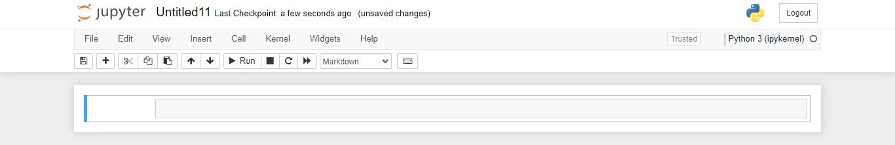
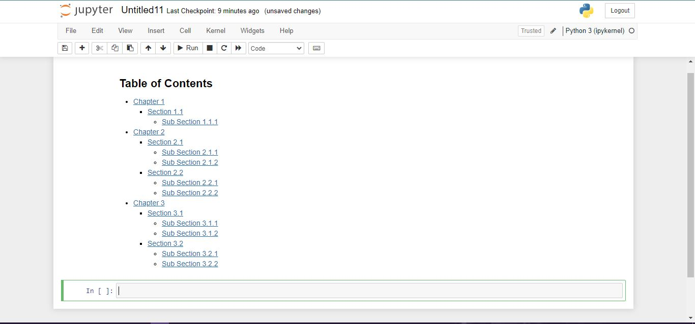
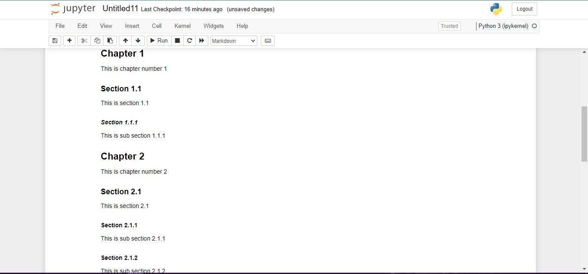

As a statistician or a data analyst, writing reports and showcasing results is the most essential part. When you are dealing with a large data analysis project it is obvious that there will be several sections and sub-sections which you will explain in our report. Not only for the writing report; even if to write a blog or some article, there will be also several sections that you will mention. So, to give your reader a brief idea about what are the things that are mentioned in your blog or article one of the most important feature is to give a Table of Contents.  

Today I'm going to share the steps that how I'm creating my content list for my blog posts and reports which I usually create by using R Markdown & Jupyter Notebook.
pdf_document

# R Markdown

For R Markdown adding a content list is very easy. You can add a table of contents (TOC) using the `toc` option. For example:

## PDF Document
```{r,eval=FALSE}
---
title: "Habits"
output:
  pdf_document:
    toc: true
---
```

## HTML Document
```{r,eval=FALSE}
---
title: "Habits"
output:
  html_document:
    toc: true
---
```

There are some other options to customize content list:

```{r,eval=FALSE}
---
title: "Habits"
output:
  html_document:
    toc: true                # table of content true/yes
    toc_depth: 3             # upto three depths of headings (specified by #, ## and ###)
    number_sections: true    # if you want number sections at each table header
    theme: united            # many options for theme, this one is my favorite.
    highlight: tango         # specifies the syntax highlighting style
    css: my.css              # you can add your custom css, should be in same folder
---
```

For more details see: [https://bookdown.org/yihui/rmarkdown/html-document.html](https://bookdown.org/yihui/rmarkdown/html-document.html)


# Jupyter Notebook
The only tools required to include a table of contents in a Jupyter notebook are the **"anchor tags"** in the appropriate places. The links that point to the other sections of the notebook’s table of content are translated into such links.

Creating a table of content in a Jupyter notebook is quite easy and simple. We can add the table of content in the Jupyter notebook using the HTML anchor. See the followin steps:

## Step 1: Select the Markdown Format
Open the Jupyter notebook and select the markdown cell format instead of the code.



## Step 2: Create the Structure of the Table of Content
First, create a table of contents using the markdown in the notebook. Here, we also need to link the anchors that we will create in the next step. Use the following text and paste it into the markdown cell:

```{r,eval=FALSE}
## Table of Contents
* [Chapter 1](#chapter1)
    * [Section 1.1](#section_1_1)
        * [Sub Section 1.1.1](#sub_section_1_1_1)
* [Chapter 2](#chapter2)
    * [Section 2.1](#section_2_1)
        * [Sub Section 2.1.1](#sub_section_2_1_1)
        * [Sub Section 2.1.2](#sub_section_2_1_2)
    * [Section 2.2](#section_2_2)
        * [Sub Section 2.2.1](#sub_section_2_2_1)
        * [Sub Section 2.2.2](#sub_section_2_2_2)
* [Chapter 3](#chapter3)
    * [Section 3.1](#section_3_1)
        * [Sub Section 3.1.1](#sub_section_3_1_1)
        * [Sub Section 3.1.2](#sub_section_3_1_2)
    * [Section 3.2](#section_3_2)
        * [Sub Section 3.2.1](#sub_section_3_2_1)
        * [Sub Section 3.2.2](#sub_section_3_2_2)
```
Press **Shift + Enter** to run the previous lines in the Jupyter notebook. The table of content should display like this:



Note that, the displayed name of the link is enclosed in brackets `[]` and the reference to the anchor tags is placed in parenthesis preceded by a hash `(#)` symbol.

## Step 3: Create Anchor Tags
Now, we will create the anchor tags in order to link with the table of contents. Create the chapters, sections, and subsections. Enter the following text in the next markdown cell:

```{r,eval=FALSE}
## Chapter 1 <a class="anchor" id="chapter1"></a>
This is chapter number 1
### Section 1.1 <a class="anchor" id="section_1_1"></a>
This is section 1.1
##### Section 1.1.1 <a class="anchor" id="sub_section_1_1_1"></a>
This is sub section 1.1.1
## Chapter 2 <a class="anchor" id="chapter2"></a>
This is chapter number 2
### Section 2.1 <a class="anchor" id="section_2_1"></a
This is section 2.1
#### Section 2.1.1 <a class="anchor" id="sub_section_2_1_1"></a>
This is sub section 2.1.1
#### Section 2.1.2 <a class="anchor" id="sub_section_2_1_2"></a>
This is sub section 2.1.2
### Section 2.2 <a class="anchor" id="section_2_2"></a>
This is section 2.2
#### Section 2.2.1 <a class="anchor" id="sub_section_2_2_1"></a>
This is sub section 2.2.1
#### Section 2.2.2 <a class="anchor" id="sub_section_2_2_2"></a>
This is sub section 2.2.2
## Chapter 3 <a class="anchor" id="chapter3"></a>
This is chapter number 3
### Section 3.1 <a class="anchor" id="section_3_1"></a>
This is section 3.1
#### Section 3.1.1 <a class="anchor" id="sub_section_3_1_1"></a>
This is sub section 3.1.1
#### Section 3.1.2 <a class="anchor" id="sub_section_3_1_2"></a>
This is sub section 3.1.2
### Section 3.2 <a class="anchor" id="section_3_2"></a>
This is section 3.2
#### Section 3.2.1 <a class="anchor" id="sub_section_3_2_1"></a>
This is sub section 3.2.1
#### Section 3.2.2 <a class="anchor" id="sub_section_3_2_2"></a>
This is sub section 3.2.2
```

Press **Shift + Enter** or run this cell to see the effects. The following output should display on your notebook:



Here, you will notice that you can easily navigate to the desired section from the table of content.


Note that, We can also add a table of content in a Jupyter notebook using the pre-build extensions [click here](https://jupyter-contrib-nbextensions.readthedocs.io/en/latest/nbextensions/toc2/README.html).


